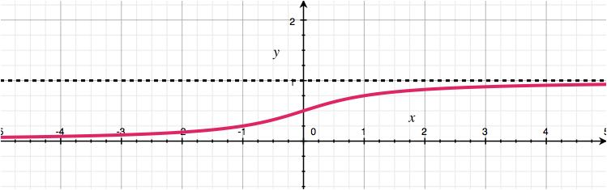
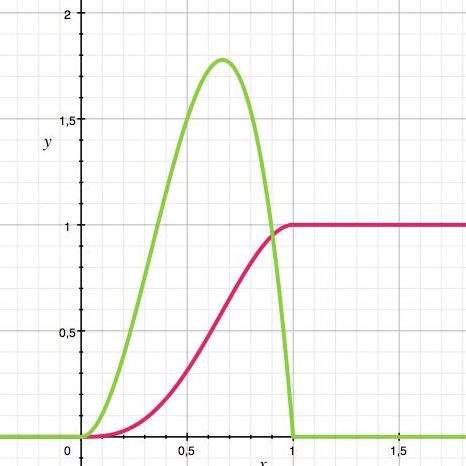

# Übung 4
## Aufgabe 4.1
**Gegeben sei eine Funktion $f:R \rightarrow R$ mit**

|f(x) = | $1 - | x - 1|$ | für $-1 <= x <= 1$
| --- | --- |
| | $0$ | **sonst** |

*Ideen:*
f(x) ist für x<0 negativ, somit keine gültige Dichtefunktion!

(a) **Zeigen Sie, dass $f$ Dichtefunktion einer Verteilungsfunktion ist.**

Eigenschaften einer Verteilungsfunktion:
 1. $F$ ist monoton steigend
 2. $F$ ist rechtsseitig stetig
 3. $lim_{x \rightarrow- \infty} F(x)=0$ und $lim_{x \rightarrow \infty} F(x)=1$

*Idee: *
Da Integral Dichtefunktion die Verteilungsfunktion $F(X)$ ist müssen diese Kriterien auf das Integral von $\int f(x)=F(X)$ zutreffen.

*z.z. F(X) monoton steigend*

* $F'(x) >= 0$
da $F'(x) = f(x)$ und $f(x) >= 0$
$$ \rightarrow F(X)\text{ monoton steigend}$$

*Z.z. F(X) ist rechtsseitig stetig*

  * Da f'(x) keine Nullstellen -> ganz F(x) stetig, somit auch rechtsstetig

  TODO: (ggf. noch rechnen)

*Z.z. $lim_{x \rightarrow- \infty} F(x)=0$ und $lim_{x \rightarrow \infty} F(x)=1$ :*
* $lim_{x \rightarrow- \infty} F(x) = lim_{x \rightarrow- \infty} \int_{-\infty}^{x} 0 = 0$

* $lim_{x \rightarrow \infty} F(x) = lim_{x \rightarrow \infty} \int_{-\infty}^{x} f(x) =
\int_{-1}^{0} f(x) + \int_{0}^{1} f(x) = $

  $= \int_{-1}^{0} f(x) dx+ \int_{0}^{1} f(x) dx=
 \int_{-1}^{0} (1+(x-1))dx + \int_{0}^{1} (-x+2) dx =$

 $= [0,5 x^2]_{-1}^0 + [-0,5x^2+2x]_0^1 =$

 $= -0,5 - 0,5 + 2 = 1$

(b)  **Bestimmen Sie Erwartungswert und Median**

$E(X) = \int_0^\infty (1-F(x))dx - \int_{-\infty}^0 F(x)dx = $

## Aufgabe 4.2
**Gegeben sei eine Funktion $f: R \rightarrow R$ mit
$$f(x) =\frac{1}{\pi(1 +x^2)}$$**
**(a) Zeigen Sie, dass $f$ Dichtefunktion einer Verteilungsfunktion ist (Hilfreich konnte die Aufgabe 7.4 aus Mathematik II des letzten Semesters sein.).**
$$F(x) =\frac{1}{\pi} arctan(x)$$**

$\int_{-\infty}^{\infty} f(x)dx =
[\frac{1}{\pi} arctan(x)]_{-\infty}^{\infty} = $
LIMES FEHLT
$= = 1$

-> ja Dichtefunktion

**(b)  Bestimmen Sie die Verteilungsfunktion und skizzieren Sie den Graphen der Verteilungsfunktion.**

$F(t) =
[\frac{1}{\pi} arctan(x)]_{-\infty}^{t} =
\frac{1}{\pi} lim_{a \rightarrow -\infty} [arctan(x)]_a^t=$
$=\frac{1}{\pi} lim_{a \rightarrow -\infty} (arctan(t)-arctan(a))$
$=\frac1\pi (arctan(t)-\frac{\pi}{2})$
$=\frac1\pi arctan(t)-\frac12$

-> Hierfür gäbe es gibt keinen Erwartungswert

## Aufgabe 4.3
**Die Lebensdauer $X$ (in Zeiteinheiten) eines Speichermedium seines Computers kann durch die Dichtefunktion **

| $f(x) =$ | $0$ | für $x <=0$|
| --- | --- |
|   | $0,06x^2e^{-0,02x^3}$ |für $x >0$ |

**beschrieben werden.**

**(a)  Bestimmen Sie die Verteilungsfunktion von X.**

$F(t) = \int_{-\infty}^t f(x) dx $

$= \int_{0}^t f(x) dx$

TODO: Substitution einfügen

SUBSTITUIEREN: ($-0,02x^3$)

$=[-e^{-0.02 x^3}]_{0}^t = -e^{-0.02 x^3} + e^0 = 1 -e^{-0.02 x^3}$

| $F(x) =$ | $0$ | für $x <=0$|
| --- | --- |
|   | $1-e^{-0.02 x^3}$ |für $x >0$ |

**(b)  Wie  groß  ist  die  Wahrscheinlichkeit  dafür,  dass  ein  solches  Bauelement mindestens 2 Zeiteinheiten ausfallfrei arbeitet?**

$P (X >= 2) =$
$=1 - F(2) $
$= 1-(1-e^{ -0.02 *2^3} )$
$= 1-(1-e^{-0,16} ) $
$= e^{-0,16} \approx 0,852 $

**(c)  Welche Zeit überleben ungefähr 90% der Bauelemente?**

$P(X>=x) = 0.9$

$1- F(x) = 1- (1-e^{-0.02 x^3}) = e^{-0.02 x^3} =0.9$
$$ e^{-0.02 x^3} = 0.9$$
$$ -0.02 x^3 = ln(0.9)$$
$$ x^3 = -ln(0.9) / 0.02$$
$$ x = \sqrt[3]{-ln(0.9) / 0.02}$$
$$ x_1 = 1.74; x_{2,3}\text{ n.def. in R }$$

## Aufgabe 4.4
**Es sei $f$ eine durch **

| $f(x) =$ | $\alpha x^2(1-x)$ |für | $0<=x<=1$
| --- |
| | 0 |für |$-\infty < x <0$ und $1< x <\infty$|

** gegebene Funktion mit $\alpha \in R$. **

(a) **Bestimmen Sie $\alpha$ so, dass $f$ die Dichtefunktion einer stetigen Zufallsgröße ist.**

Gesucht $\alpha$ für: $\int_{-\infty}^{\infty} f(x) dx <=> \int_0^1 f(x) dx = 1$

$\int_0^1 (\alpha x^2(1-x)) dx $
$= \alpha \int_0^1  x^2(1-x) dx $
$= \alpha \int_0^1  (x^2-x^3) dx $
$= \alpha( \int_0^1  x^2dx-\int_0^1 x^3 dx )$
$= \alpha([\frac{x^3}{3}]_0^1 -[\frac{x^4}{4}]_0^1)$
$= \alpha (\frac13 - \frac14)$
$= \alpha \frac{1}{12}$
$$\rightarrow \alpha = 12$$

mit $\alpha =12$ $f(x)>=0 \rightarrow$ passt

(b) **Ermittlen Sie die Verteilungsfunktion und den Erwartungswert E(X).**

Verteilungsfunktion aus Zeile bei a: $ \alpha([\frac{x^3}{3}]_0^1 -[\frac{x^4}{4}]_0^1) $

FIXME: Hier Fehler

| $F(t) =$ | $0$ |für | $0<t$
| --- |
| | $12(\frac{x^3}{3} -\frac{x^4}{4}) $ |für | $0<=t<=1$
| | 1 |für |$t>1$|

$E(X) = \int ... = [\frac{12x^4}{4}- \frac{12x^5}{5}]^1_0 = \frac35$

TODO: Erwartungswert E(X) bestimmen!

*Median bei F(x) = 1/2:*

$$12x^3(\frac{1}{3} -\frac{x}{4}) = 0.5$$
$$x_1 = 0.613272$$
$$x_2 = 1.24748 \text{(nicht im Intervall)}$$
$$ x_{3,4} \text{ n.d. in R}$$
$$ \rightarrow\text{ Median bei }x=0.613272$$

(c) **Skizzieren Sie die Graphen der Dichte- und der Verteilungsfunktion.**

(d) **Berechnen Sie $P(X <\frac{1}{2})$ und $P(X < E(X))$.**

$P(X <\frac{1}{2}) = \int_{0}^{0.5}12x^2(1-x)dx =\frac5{16}$

TODO: Fill Integral

$P(X < E(X)) = \int_0^{0.6} 12x^2(1-x)dx = 0.4752$

## Aufgabe 4.5
**Die  ausfallfreie  Arbeitszeit $X$ (in  Zeiteinheiten)  einer  Art von Computerbauteilen hat die folgende Verteilungsfunktion $F(t)$:**

|  $F(t)=$  | $0$ für $t <0$ |
| --- | ---: |
| | $1-e^{-0,5t}$ für $t>=0$|

(a)  **Bestimmen Sie die Wahrscheinlichkeit dafür, dass ein solches Bauteil mindestens eine Zeiteinheit ohne Ausfall arbeitet.**

$P(X>=1) = 1- P(X<1) $
$= 1 - (P(X<=1)-P(X=1))$
$= 1- F(1) =  e^{-0.5} (\approx 0.303)$

(b) **Bestimmen  Sie  die  zugehörige  Dichtefunktion $f(x)$ der  Verteilungsfunktion $F$ und die mittlere ausfallfreie Arbeitszeit.**

$f(t) = F'(t) = - e^{-0.5t} (-0.5)=0,5 e^{-0.5t}$
angeblich fällt das t im Potenz weg:
$0,5 e^{-0.5}$

|  $f(t)=$  | $0$ für $t <0$ |
| --- | ---: |
| | $0.5 e^{-0,5t}$ für $t>=0$|

$E(X) = \int_{-\infty}^{\infty}x*f(x) dx$
$= \int_{0}^{\infty}x*f(x) dx $
$= $

---

$\int x*0,5 e^{-0,5x} dx =
0,5 \int x*e^{-0,5x}dx =$

*partielle Integration*
$$ v = x; u' = -e^{-0,5x}$$
$$ v' = 1; u = 0,5*e^{-0,5x}$$

$$\int u v' = uv - \int u'v$$

---
das hier stimmt nicht:

$
[0,5*x * (-0,5)*e^{-0,5x}] - \int(0,5*(-0,5)*e^{-0,5x})=$
$[-0.25x*e^{-0,5x}]-[-0.5 e^{-0.5x}]$

$E(X) = [-0.25x*e^{-0.5x}]_{0}^{\infty}-[-0.5 e^{-0.5x}]_{0}^{\infty} =$

$=lim_{x \rightarrow \infty} (-0.25x*e^{-0,5x}+0.5 e^{-0.5x}) = ?$

---
es sollte rauskommen: (Bestätigt durch Wolfram Alpha)
$=2$
